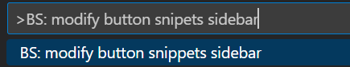
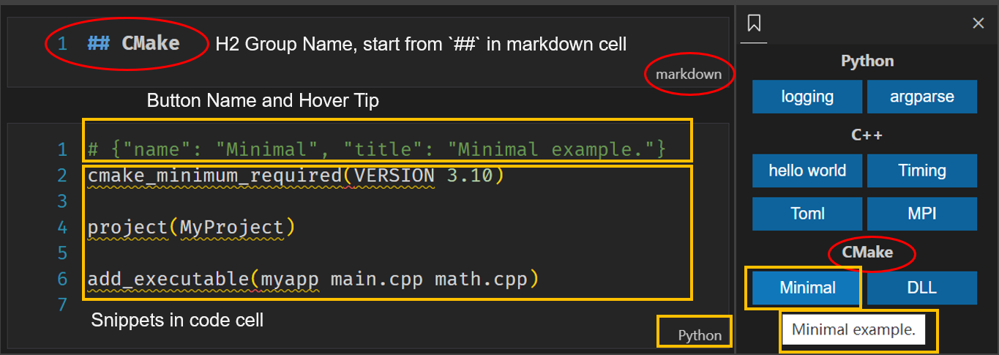
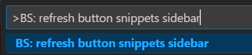

# Button Snippets

**It is highly recommended to configure this plugin on the right side of the main view (just drag the icon to the right side of the page) to avoid repeated switching of the sidebar.**

If you have any suggestions, please send an email to litchi.code@foxmail.com.

## Features

1. The button provided in the sidebar, when clicked, adds a specified code snippet at the current position in the editor.
2. Users can conveniently customize the sidebar, including: editing code snippets and adding or deleting buttons.

### Customize the sidebar

1. Use the command palette of `VS Code` (Open it with `F1`), enter `BS: modify button snippets sidebar`, and open the notebook file used for writing the sidebar. This may require you to install the [Jupyter](https://marketplace.visualstudio.com/items?itemName=ms-toolsai.jupyter) plugin in VS Code to view it better.

2. Refer to the following figure to write your own required code snippets and button names. After modification, save and close the file.

3. Use the command palette of `VS Code` (Open it with `F1`), enter `BS: refresh button snippets sidebar`, and restart VS Code to see the modified sidebar.

## Requirements

Ensure that the version of `VS Code` is higher than `1.72.0`.

## Release Notes

See CHANGELOG.

